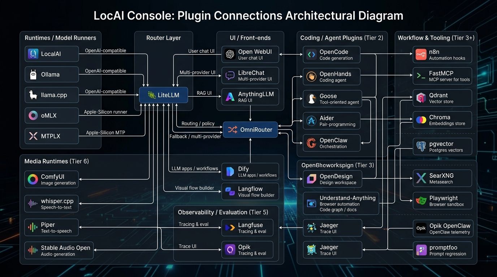

# LocAI Console Plugin Link Feasibility Map and Graph

## Overview
This document visualises how the various **app plugins** listed in the `OPEN_SOURCE_ECOSYSTEM_CATALOG.md` can be linked together inside **LocAI Console**. The diagram focuses on the most commonly-used integration paths and groups plugins by functional tier.

---
### Plugin Link Graph

---
### Plugin Connection Table
| Plugin | Tier | Directly Connects To |
|--------|------|----------------------|
| LocalAI | Core (Tier 1) | LiteLLM, OpenWebUI |
| Ollama | Core (Tier 1) | LiteLLM, OpenWebUI |
| llama.cpp | Core (Tier 1) | LiteLLM |
| oMLX | Optional (Tier 1) | LiteLLM |
| MTPLX | Optional (Tier 1) | LiteLLM |
| LiteLLM | Core (Tier 1) | OmniRouter, OpenWebUI, agents, observability |
| OmniRouter | Optional (Tier 1) | LiteLLM, OpenClaw, Dify, Langflow |
| Open WebUI | Core (Tier 1) | LiteLLM, agents (OpenCode, OpenHands) |
| LibreChat | Core (Tier 3) | LiteLLM |
| AnythingLLM | Core (Tier 3) | LiteLLM, Qdrant, Chroma |
| Dify | Core (Tier 3) | OmniRouter, pgvector |
| Langflow | Core (Tier 3) | OmniRouter |
| OpenCode | Tier 2 | LiteLLM, n8n |
| OpenHands | Tier 2 | LiteLLM |
| Goose | Tier 2 | LiteLLM |
| Aider | Tier 2 | LiteLLM |
| OpenClaw | Tier 2 | OmniRouter, Opik OpenClaw |
| OpenDesign | Tier 2 | OpenWebUI |
| Browser Use | Tier 2 | OpenWebUI, SearXNG |
| Understand-Anything | Tier 2 | OpenWebUI |
| n8n | Tier 3 | OpenCode, FastMCP |
| FastMCP | Tier 3 | OpenCode |
| Qdrant | Tier 4 | AnythingLLM |
| Chroma | Tier 4 | AnythingLLM |
| pgvector | Tier 4 | Dify |
| SearXNG | Tier 4 | Browser Use |
| Playwright | Tier 4 | Browser Use |
| Langfuse | Tier 5 | LiteLLM, Jaeger |
| Opik | Tier 5 | OmniRouter, Promptfoo |
| Opik OpenClaw | Tier 5 | Opik |
| Jaeger | Tier 5 | Langfuse |
| promptfoo | Tier 5 | Opik |
| ComfyUI | Tier 6 | LiteLLM |
| whisper.cpp | Tier 6 | LiteLLM |
| Piper | Tier 6 | LiteLLM |
| Stable Audio Open | Tier 6 | LiteLLM |

---
### How to Use This Graph
- **Identify data flow**: Follow arrows from model runtimes → router (LiteLLM/OmniRouter) → UI or agents.
- **Add new plugins**: Add a new row to the table above and update the graph image if needed.
- **Validate compatibility**: Ensure any new plugin matches the required API contract (OpenAI-compatible, MCP, or custom REST).

Feel free to edit the diagram or table if you need to add/remove plugins or change grouping styles.
